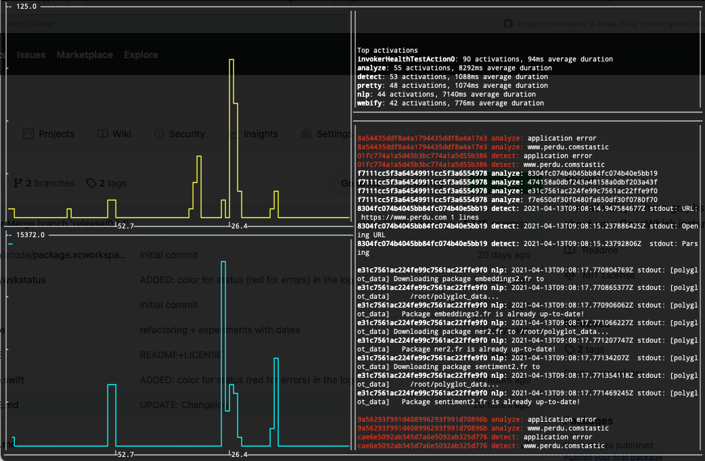

# wskstatus

wskstatus lists activations from your wsk instance and displays a bunch of statistics

`wskstatus --help` for more information

### Description

On the left, the top graph represents the number of activations in the timeframe, the bottom one, the average duration of an action.  
On the right, the top text window gives you the number of activations of as many of the top actions that can fit, and the bottom one is a live log of your latest activations. If the exit status code is nonzero (meaning failed), the name and id of the action will be displayed in red.

### Command line flags and options

#### OpenWhisk

`-b <address>` / `--baseurl <address>` overrides the contents of `~/.wskprops` with a different OpenWhisk instance URL

`-n <namespace>` / `--namespace <namespace>` overrides the contents of `~/.wskprops` with a different OpenWhisk namespace

`-t <token>` / `--token <token>` overrides the contents of `~/.wskprops` with a different OpenWhisk access token

#### Binning

`-f <interval>` / `--frame <interval>` sets the length of the time interval to aggregate data for. Possible values are:
- minutely
- hourly
- daily
- weekly
- monthly
- yearly

One column of your terminal will represent one minute/hour/day/week/month/year and all the actions within that time frame will be summed/averaged.

### Useful links

- [OpenWhisk](https://github.com/apache/openwhisk)
- [TermPlot](https://github.com/krugazor/TermPlot)

### Change Log

- 0.1.2: cleanup and some documentation
- 0.1.1: added color (red for errors) in the action log subwindow
- 0.1.0: initial release

### Known issues

- Because of the poor resolution of a terminal graph, extreme variations may not be displayed. This applies especially at very large timescales, like when there is a few activations in over a year. The graph may display a flat line instead of a spike.